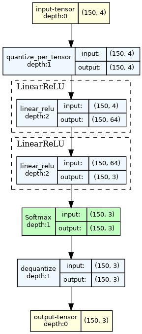

# Two layer neural net with PyTorch

```
# do once
conda create -n Iris -c pytorch python==3.11
conda activate Iris
conda install \
      numpy \
      matplotlib \
      pytorch::pytorch \
      scikit-learn \
      tqdm
conda install -c conda-forge \
      torchview

# do always
conda activate Iris
python train.py
python infer.py
```



# for use with soda-opt
```
git clone git clone --recursive git@github.com:cmu-sei/soda-opt-docker.git
cd soda-opt-docker
docker build --rm --pull -f ./Dockerfile -t soda-opt:dev-panda .
docker run --rm -it --network=host --privileged -e DISPLAY=$DISPLAY -e UID=$(id -u) -e GID=$(id -g) -v `pwd`/env:/home/soda-opt-user/env:rw -v `pwd`/work:/home/soda-opt-user/work soda-opt:dev-panda
# in the container
cd work/pytorch-iris/
./getmakefile.sh
make synth-baseline
```

For updating the Makefile patch. Makefile isn't version controlled, so this
is a bit odd. For minor changes directly edit Makefile.patch.
```
# get the soda opt version
wget -O Makefile.orig https://github.com/pnnl/soda-opt/raw/main/docs/tutorials/pytorch/matmul_accel_gen/docker-version/Makefile
# apply current patch
./getmakefile.sh
# edit Makefile to desired. Add the copyright so that it appears in the patch.
diff -u Makefile.orig Makefile > Makefile.patch
# edit the patch to change Makefile.orig to Makefile
# run patch to see if you get what you want
./getmakefile.sh
```
